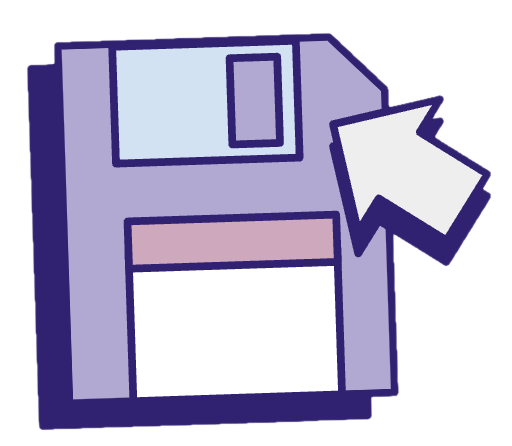

  

  

  # Disc Drwr

  ### [GITHUB LINK](https://github.com/mellygriffin/disc-drwr)

  ##### Melissa Griffin

  ## :floppy_disk: Description

 "Disc Drwr" is your new personal video game progress tracker and library. Log games you've played, or plan to play and leave notes about what you've yet to do. Keep your games organized in an easy-to-read format with Disc Drwr!

  

## Screenshots 

  |   Description | Screenshot | 
  |:-------------:| -----------|
  | <h3>Home Screen, no login</h3> |  |
  | <h3>"Home Screen, logged user</h3> |  |
  | <h3>My Games Screen</h3> |  |
  | <h3>Add Game Screen</h3> |  |
  | <h3>Game Information Screen</h3> |  |
   | <h3>Edit Game Screen</h3> |  |

  ## :computer: Technologies Used

  
  
  
  
  
  
  
  

## :minidisc: Getting Started

  
 User Guide

    1. Sign Up to create a username and password for your personal library.

    2. Navigate to the My Games page and click New Game to add games to your library.

    3. Edit games by selecting the game you wish to change and clicking "Edit Game".

    4. Finalize your changes by clicking the "Update Game" button.

    5. Delete any games by selecting them then clicking the "Delete" button on the information page.

  
 Deployed Link (GitHub) 

  <a href="#"
    > #</a
  >

## :construction: Upcoming Features

- :white_square_button: Graphics Updates

- :white_square_button: Community Hub, allow users to see other users game progress and libraries

- :white_square_button: User Profiles